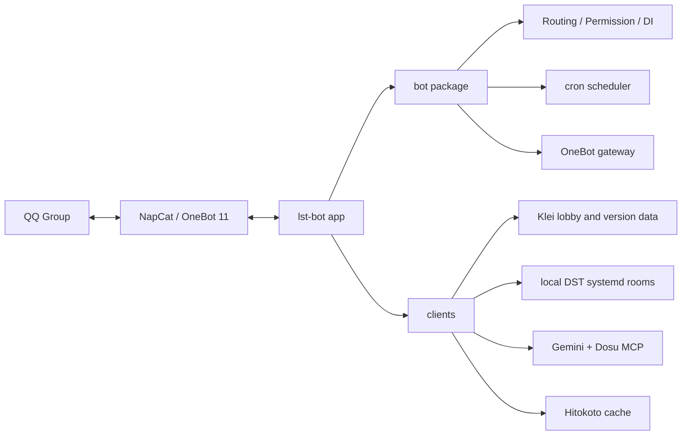

# lst-bot

English | [简体中文](README.zh-Hans.md)

`lst-bot` is a general-purpose IM bot for the **LST** player community.

**Let's Starve Together (LST)** is a community formed around *Don't Starve Together (DST)*. The repository contains the LST bot app, a reusable async bot package, and standalone client packages. `src/lst_bot/` holds the current bot behavior, while `pkgs/bot/` handles OneBot ingress, event dispatch, dependency injection, scheduled jobs, and action execution.

## What It Does

- Connects through NapCat / OneBot 11.
- Looks up DST versions, Klei lobbies, room details, and online players.
- Manages local DST rooms for the LST group: save, rollback, restart, and regenerate.
- Sends scheduled active-room reports to an IM group.
- Answers DST questions with Gemini + Dosu MCP.

## Architecture

## Layout

- `pkgs/bot/`: standalone async bot framework package.
- `pkgs/hitokoto/`: standalone Hitokoto client package.
- `pkgs/klei/`: standalone Klei lobby, version, and forum client package.
- `pkgs/lst/`: standalone local DST room control client package.
- `src/lst_bot/`: bot entrypoint, runtime settings, and DST question agent.
- `systemd/`: NapCat container and lst-bot service units.
- `tests/`: root app tests.
- Package tests live beside their owning packages.

## Configuration

The app reads `.env` from its working directory. Development and deployment both run from the repository root, so the usual location is `.env`.

Core settings:

| Name | Purpose |
| --- | --- |
| `ONEBOT_WS_URL` | NapCat OneBot 11 WebSocket URL |
| `ONEBOT_ACCESS_TOKEN` | OneBot access token |
| `BOT_ADMIN` | Admin account IDs |
| `BOT_CMD_PREFIXES` | Command prefixes |
| `REPORT_GROUP_ID` | IM group for scheduled reports |
| `KLEI_ACCESS_TOKEN` | Klei lobby/read token |
| `KLEI_HOST_ID` | DST host ID managed for the LST group |
| `GEMINI_API_KEY` | Gemini question answering |
| `DOSU_MCP_ENDPOINT` | Dosu MCP endpoint |
| `DOSU_API_KEY` | Dosu access token |
| `HTTP_PROXY` | Proxy for outbound HTTP requests |
| `LOG_LEVEL` | Log level |

## Development

- `just sync`: sync all workspace packages and install hooks.
- `just dev`: start the bot app package.
- `just check`: run CI-style checks.
- `just test`: run the full test pipeline.
- `just build`: check and build the package.

## Deployment

The default paths are `/srv/lst-bot` and `/srv/napcat`.

`systemd/napcat.container` is a Podman Quadlet file. It generates `napcat.service` and stores NapCat config plus QQ data under `/srv/napcat/config` and `/srv/napcat/ntqq`.

`systemd/lst-bot.service` starts the bot from `/srv/lst-bot` after `napcat.service`.

Deployment checklist:

1. Place the repository at `/srv/lst-bot` and run `just sync`.
2. Enable the NapCat container and make sure its OneBot 11 WebSocket is reachable.
3. Fill `.env` with OneBot, Klei, Gemini, Dosu, and report-group settings.
4. For room management, provide local `dst@<room>.service` units.
5. Make sure the service user can control lst-bot, NapCat, and DST room units.

If the paths change, update `WorkingDirectory`, `ExecStart`, and NapCat volumes in the systemd files.
