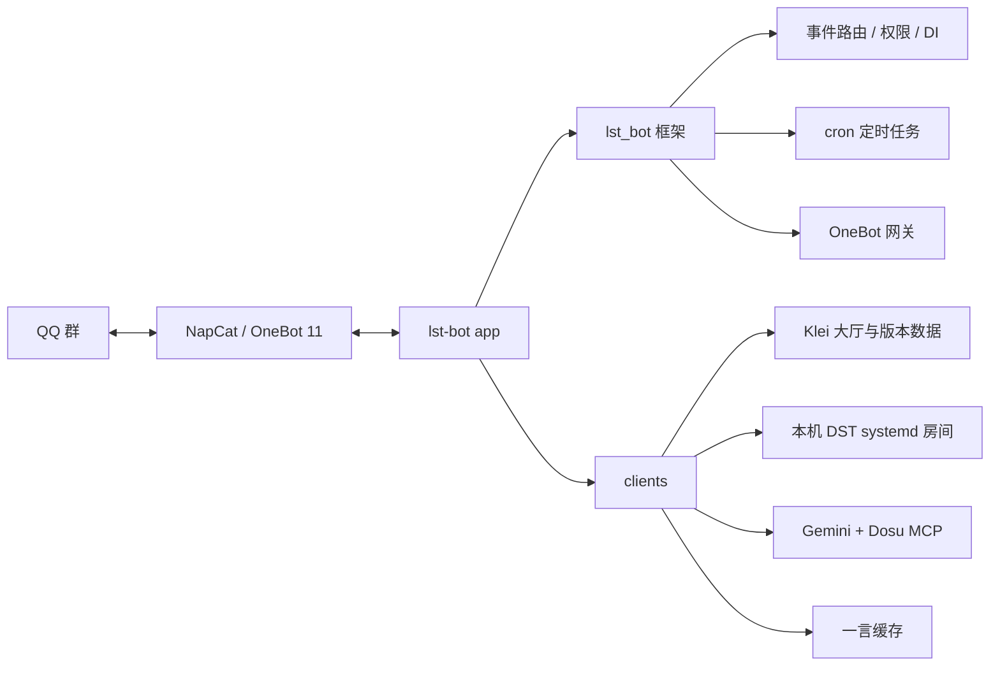

# lst-bot

[English](README.md) | 简体中文

`lst-bot` 是一个给 Let's Starve Together 玩家群体用的通用 IM 机器人。

Let's Starve Together（LST）是围绕《饥荒联机版》（Don't Starve Together, DST）形成的自发游戏群体。仓库由 LST 机器人应用和内置异步机器人框架组成。`app/` 承载当前业务实现，`src/lst_bot/` 负责 OneBot 接入、事件分发、依赖注入、定时任务和动作执行。

## 它会做什么

- 接入 NapCat / OneBot 11。
- 查询 DST 最新版本、Klei 大厅、房间详情和在线玩家。
- 管理 LST 使用的本机 DST 房间：存档、回档、重启、重置。
- 定时向 IM 群报告活跃房间。
- 用 Gemini + Dosu MCP 回答 DST 相关问题。

## 整体结构

## 目录

- `app/`：机器人业务入口、配置、问答 Agent 和 systemd 部署文件。
- `app/systemd/`：NapCat 容器和 lst-bot 服务。
- `src/lst_bot/`：项目内置机器人框架。
- `src/lst_bot/clients/`：Klei、DST 本地控制、一言等客户端。
- `tests/`：协议、路由、网关和客户端测试。

## 配置

应用从运行目录读取 `.env`。开发和部署都以 `app/` 作为工作目录，所以通常放在 `app/.env`。

核心配置：

| 变量 | 用途 |
| --- | --- |
| `ONEBOT_WS_URL` | NapCat 的 OneBot 11 WebSocket 地址 |
| `ONEBOT_ACCESS_TOKEN` | OneBot 鉴权 |
| `BOT_ADMIN` | 管理员账号 ID 列表 |
| `BOT_CMD_PREFIXES` | 命令前缀 |
| `REPORT_GROUP_ID` | 定时报告 IM 群 |
| `KLEI_ACCESS_TOKEN` | Klei lobby/read token |
| `KLEI_HOST_ID` | LST 需要管理的 DST 主机 ID |
| `GEMINI_API_KEY` | Gemini 问答 |
| `DOSU_MCP_ENDPOINT` | Dosu MCP 地址 |
| `DOSU_API_KEY` | Dosu 鉴权 |
| `HTTP_PROXY` | 外部请求代理 |
| `LOG_LEVEL` | 日志等级 |

## 开发

- `just sync`：同步依赖并安装 hooks。
- `just dev`：从 `app/main.py` 启动机器人。
- `just check`：运行 CI 风格检查。
- `just test`：运行完整测试链路。
- `just build`：检查并构建。

## 部署

默认按 `/srv/lst-bot` 和 `/srv/napcat` 设计。

`app/systemd/napcat.container` 是 Podman Quadlet 配置，会生成 `napcat.service`，并把 NapCat 的配置和 QQ 数据放到 `/srv/napcat/config`、`/srv/napcat/ntqq`。

`app/systemd/lst-bot.service` 负责启动机器人，工作目录是 `/srv/lst-bot/app`，并在 `napcat.service` 之后启动。

部署时只需要确认几件事：

1. 项目位于 `/srv/lst-bot`，并已运行 `just sync`。
2. NapCat 容器已启用，OneBot 11 WebSocket 可连。
3. `app/.env` 已填好 OneBot、Klei、Gemini、Dosu 和报告群配置。
4. 需要房间管理时，本机存在 `dst@<room>.service` 这类 DST 房间服务。
5. 运行用户有权限控制 lst-bot、NapCat 和 DST 房间服务。

如果路径不同，记得同步调整 systemd 文件里的 `WorkingDirectory`、`ExecStart` 和 NapCat volume。
